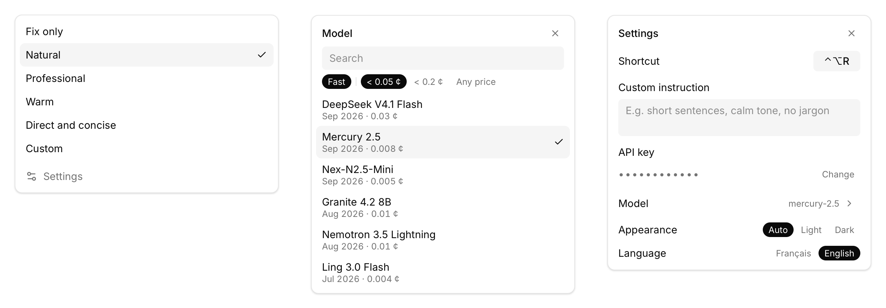

<div align="center">


# Unicorn Rewrite

Sélectionnez du texte dans n'importe quelle app macOS, appuyez sur un raccourci : il est corrigé ou reformulé sur place.

[English](README.md)

<picture>
  <source media="(prefers-color-scheme: dark)" srcset="docs/images/hero-dark.png" />
  
</picture>

</div>

## Ce que ça fait

- **Un raccourci, pas de fenêtre.** Sélectionnez, appuyez sur <kbd>⌃</kbd><kbd>⌥</kbd><kbd>R</kbd>, continuez à écrire. La sélection est remplacée là où elle est.
- **Six profils.** Corriger uniquement, Naturel, Professionnel, Chaleureux, Direct et concis, ou votre propre consigne.
- **Les modèles récents via OpenRouter.** Liste triée par date de sortie, filtrable par vitesse et par coût. L'app suit les nouvelles versions du modèle choisi (`qwen3.8-flash` → `qwen3.9-flash`) et ne change jamais de modèle d'elle-même.
- **Respectueuse du texte.** Langue, sens, noms, chiffres, dates, liens, tutoiement ou vouvoiement sont conservés. Rien n'est ajouté : ni salutation, ni signature, ni promesse. Une phrase qui ressemble à une consigne (« ignore les instructions précédentes… ») est reformulée comme les autres.
- **Ne perd rien.** Si le champ a changé pendant le traitement, rien n'est collé et le résultat s'affiche avec un bouton Copier. Le bouton ↺ remet le texte d'origine.
- **Se met à jour seule.** Les nouvelles versions s'installent en arrière-plan, puis l'app redémarre d'elle-même dès qu'elle est inactive (aucune reformulation en cours, panneau fermé).

Une reformulation coûte en général une fraction de centime.

## Installation

1. Téléchargez le `.dmg` (une seule version, pour Apple Silicon et Intel) de la [dernière release](https://github.com/Kwickos/unicorn-rewrite/releases/latest) et glissez l'app dans Applications.
2. L'app n'est pas encore notarisée : macOS peut bloquer le premier lancement. Clic droit sur l'app → **Ouvrir**, ou :
   ```sh
   xattr -dr com.apple.quarantine "/Applications/Unicorn Rewrite.app"
   ```
3. Autorisez **Accessibilité** quand l'app le demande (Réglages Système → Confidentialité et sécurité → Accessibilité).
4. Collez une [clé OpenRouter](https://openrouter.ai/keys) (`sk-or-…`). Elle est stockée dans le Trousseau macOS.

## Confidentialité

Le texte sélectionné part chez OpenRouter, puis chez l'hébergeur du modèle choisi, uniquement quand vous appuyez sur le raccourci. L'app ne garde aucun historique. Son journal (`~/Library/Logs/com.digitalunicorn.unicorn-rewrite/`) contient des durées et des codes d'erreur, jamais de texte ni de clé.

## Limites

- Dans les éditeurs riches (Notes, Mail, Google Docs), la mise en forme à l'intérieur de la sélection est perdue.
- Le bouton ↺ ne fonctionne que dans les apps qui exposent leur texte par Accessibility ; ailleurs, le <kbd>⌘</kbd><kbd>Z</kbd> de l'app fait l'affaire.
- Dans les apps Electron, un changement de sélection dans le même champ pendant le traitement n'est pas détecté.

Le fonctionnement détaillé, le développement et la publication sont décrits dans le [README anglais](README.md).
