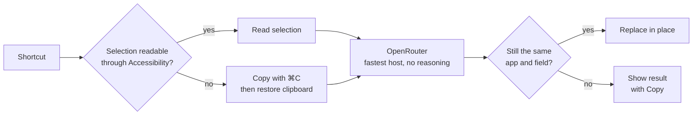

<div align="center">


# Unicorn Rewrite

Select text in any macOS app, press a shortcut, and it gets fixed or rewritten in place.

[](https://github.com/Kwickos/unicorn-rewrite/releases/latest)


[](https://github.com/Kwickos/unicorn-rewrite/releases)

[Français](README.fr.md)

<picture>
  <source media="(prefers-color-scheme: dark)" srcset="docs/images/hero-dark.png" />
  
</picture>

</div>

## What it does

- **One shortcut, no window.** Select, press <kbd>⌃</kbd><kbd>⌥</kbd><kbd>R</kbd>, keep typing. The selection is replaced where it is.
- **Six profiles.** Fix only, Natural, Professional, Warm, Direct and concise, or your own instruction.
- **Any recent model through OpenRouter.** Pick from a list sorted by release date and filtered by speed and cost. The app follows new versions of the model you picked (`qwen3.8-flash` → `qwen3.9-flash`) and never switches to a different model on its own.
- **Careful with your text.** It keeps the language, meaning, names, numbers, dates, links and tone of address. It never adds greetings, signatures or promises. Text that looks like an instruction ("ignore previous instructions…") is rewritten like any other sentence.
- **Never loses anything.** If the field changed while the model was working, nothing is pasted and the result is shown with a Copy button. The ↺ button puts the original back.
- **Updates itself.** New versions install in the background, and the app restarts on its own once it's idle (no rewrite running, panel closed).

A rewrite usually costs a small fraction of a cent.

## Install

1. Download the `.dmg` (one universal build for Apple Silicon and Intel) from the [latest release](https://github.com/Kwickos/unicorn-rewrite/releases/latest) and drag the app to Applications.
2. The app isn't notarized yet, so macOS may block the first launch. Right-click the app → **Open**, or run:
   ```sh
   xattr -dr com.apple.quarantine "/Applications/Unicorn Rewrite.app"
   ```
3. Allow **Accessibility** when asked (System Settings → Privacy & Security → Accessibility). The app needs it to read and replace the selection.
4. Paste an [OpenRouter key](https://openrouter.ai/keys) (`sk-or-…`). It's stored in the macOS Keychain.

## How a rewrite works



Native apps (Notes, Mail, TextEdit, Safari fields) are read and replaced through Accessibility, without touching the clipboard. Electron apps (Discord, Slack) go through a controlled copy and paste: your clipboard is put back afterwards, in every format, unless you copied something new in the meantime.

An empty, cut-off or runaway answer never replaces your text. Password fields are skipped.

## Privacy

The selected text is sent to OpenRouter, and from there to the host of the model you picked, only when you press the shortcut. The app keeps no history. Its log (`~/Library/Logs/com.digitalunicorn.unicorn-rewrite/`) records timings and error codes, never text or keys.

## Shortcuts

| Keys | Action |
| --- | --- |
| <kbd>⌃</kbd><kbd>⌥</kbd><kbd>R</kbd> | Rewrite the selection (change it in Settings) |
| <kbd>Esc</kbd> | Cancel while a rewrite is running |
| <kbd>⌘</kbd><kbd>Q</kbd> | Quit, while the panel is focused |

## Limitations

- In rich editors (Notes, Mail, Google Docs), formatting inside the selection (bold, links) is lost.
- The ↺ button only works in apps that expose their text through Accessibility. Elsewhere, the app's own <kbd>⌘</kbd><kbd>Z</kbd> works.
- In Electron apps, changing the selection inside the same field during a rewrite isn't detected.

Per-app notes: [docs/compatibility.md](docs/compatibility.md).

## Development

Tauri 2, Rust, React 19, TypeScript, Tailwind 4.

```sh
pnpm install
pnpm app                          # run the app
UNICORN_REWRITE_MOCK=1 pnpm app   # no key needed: fake answers
pnpm test && pnpm lint            # panel
pnpm test:rust                    # native side
OPENROUTER_API_KEY=… cargo test --manifest-path src-tauri/Cargo.toml live_ -- --ignored --nocapture
```

| Path | What's there |
| --- | --- |
| `src-tauri/src/engine.rs` | One rewrite, from shortcut to replacement, and its safety checks |
| `src-tauri/src/macos/` | Accessibility, clipboard, synthetic ⌘C/⌘V |
| `src-tauri/src/ai/` | OpenRouter client, model catalog, prompt and answer checks |
| `src/` | The menu bar panel |

To release: bump `version` in `src-tauri/tauri.conf.json`, then run `scripts/release.sh`.
